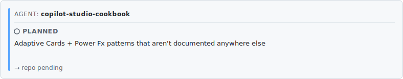
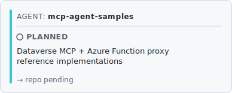
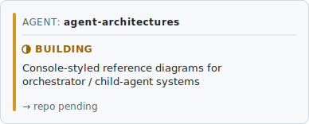
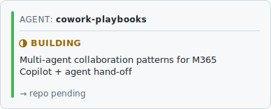
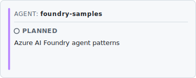
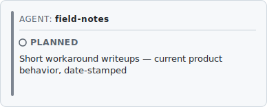

<!-- Generated by scripts/assemble-readme.ts from templates/README.tpl.md — do not hand-edit. -->

<!--
  DO NOT EDIT README.md BY HAND.
  README.md is assembled from this template by scripts/assemble-readme.ts.
  Edit this file (or config/agents.yml) and run `npm run build`.
-->

<picture><source media="(prefers-color-scheme: dark)" srcset="assets/hero-dark.svg"><source media="(prefers-color-scheme: light)" srcset="assets/hero-light.svg"></picture>

<!-- AGENT REGISTRY ─────────────────────────────────────────────── -->

<table>
  <tr><td colspan="2" align="center"><picture><source media="(prefers-color-scheme: dark)" srcset="assets/generated/copilot-studio-cookbook-dark.svg"><source media="(prefers-color-scheme: light)" srcset="assets/generated/copilot-studio-cookbook-light.svg"></picture></td></tr>
  <tr><td align="center"><picture><source media="(prefers-color-scheme: dark)" srcset="assets/generated/mcp-agent-samples-dark.svg"><source media="(prefers-color-scheme: light)" srcset="assets/generated/mcp-agent-samples-light.svg"></picture></td><td align="center"><picture><source media="(prefers-color-scheme: dark)" srcset="assets/generated/agent-architectures-dark.svg"><source media="(prefers-color-scheme: light)" srcset="assets/generated/agent-architectures-light.svg"></picture></td></tr>
  <tr><td align="center"><picture><source media="(prefers-color-scheme: dark)" srcset="assets/generated/cowork-playbooks-dark.svg"><source media="(prefers-color-scheme: light)" srcset="assets/generated/cowork-playbooks-light.svg"></picture></td><td align="center"><picture><source media="(prefers-color-scheme: dark)" srcset="assets/generated/foundry-samples-dark.svg"><source media="(prefers-color-scheme: light)" srcset="assets/generated/foundry-samples-light.svg"></picture></td></tr>
  <tr><td align="center"><picture><source media="(prefers-color-scheme: dark)" srcset="assets/generated/field-notes-dark.svg"><source media="(prefers-color-scheme: light)" srcset="assets/generated/field-notes-light.svg"></picture></td></tr>
</table>

<!-- TELEMETRY ──────────────────────────────────────────────────── -->

<picture><source media="(prefers-color-scheme: dark)" srcset="assets/generated/telemetry-dark.svg"><source media="(prefers-color-scheme: light)" srcset="assets/generated/telemetry-light.svg"></picture>

<!-- STACK MANIFEST ─────────────────────────────────────────────── -->

<details>
<summary><code>▸ cat stack.json</code></summary>

```json
{
  "agents":     ["Copilot Studio", "M365 Copilot", "Azure AI Foundry", "Copilot cowork"],
  "platform":   ["Power Platform", "Dataverse", "Dataverse MCP", "Dynamics 365"],
  "protocol":   ["Model Context Protocol", "Adaptive Cards", "Power Fx"],
  "cloud":      ["Azure", "Azure Functions", "Entra"],
  "web":        ["Next.js", "TypeScript", "Vercel"],
  "principle":  "the profile you're reading is itself a self-updating agent"
}
```
</details>

<!-- FOOTER RAIL ────────────────────────────────────────────────── -->

<sub>`caleb@orchestrator:~$` &nbsp;
[calebfunderburk.com](https://www.calebfunderburk.com) &nbsp;·&nbsp;
[in/calebfunderburk](https://www.linkedin.com/in/calebfunderburk) &nbsp;·&nbsp;
[didyoucopilotthat.com](https://didyoucopilotthat.com) &nbsp;·&nbsp;
WorthIt Finance (App Store)</sub>

<br/>

<sub><i>Personal projects and opinions. Not official Microsoft guidance, product, or support.</i></sub>
